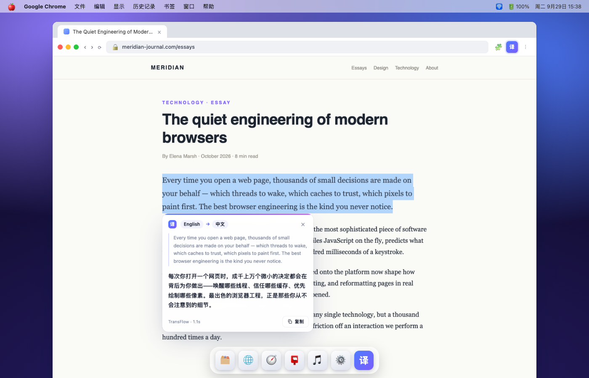
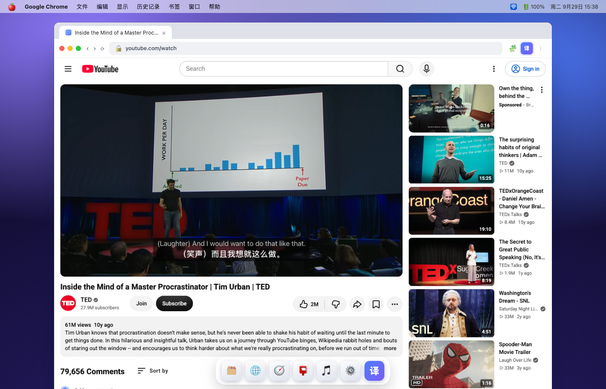
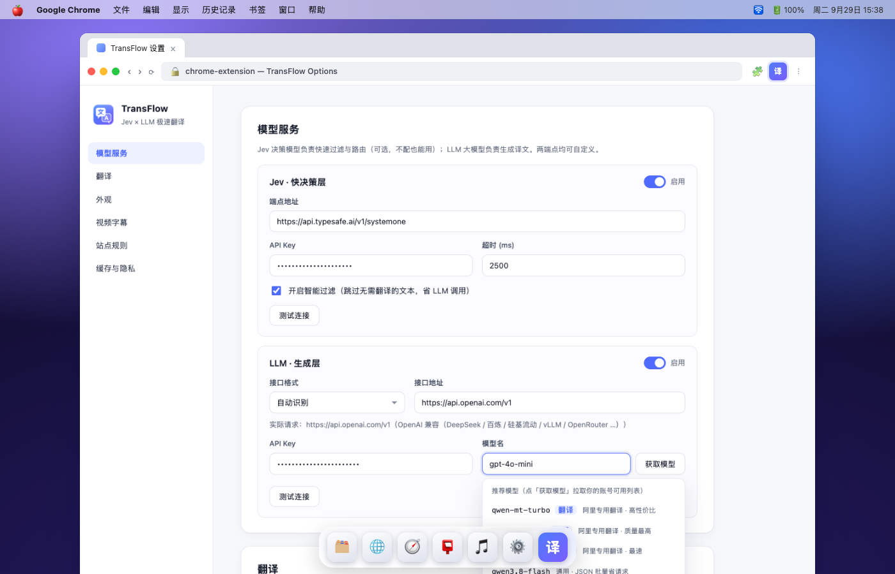

<p align="center"></p>

# TransFlow

高性能、低占用的双语网页翻译浏览器扩展 —— **Jev 决策模型**做毫秒级过滤与路由，**LLM 大模型**生成译文，两端点均可在设置中自定义。支持网页双语对照翻译与视频字幕翻译。

High-performance, low-footprint bilingual webpage-translation browser extension — a **Jev decision model** filters and routes in milliseconds, an **LLM** generates the translations. Both endpoints are user-configurable.

**中文** | [English](#english) · 调研报告 [docs/research.md](docs/research.md)

## 下载安装

到 [**Releases**](https://github.com/Chun556699/TransFlow/releases) 下载：`transflow-chrome.zip`（Chrome / Edge / Opera）或 `transflow-firefox.zip`（Firefox），解压后按下方「安装」加载即可。也可以自己构建：`npm install && npm run zip`。

## 效果预览

| 划词双语浮窗 | 视频双语字幕 | 设置页（端点自定义） |
| --- | --- | --- |
|  |  |  |

## 特性

- **双模型管线**：Jev（TypeSafe SystemOne，70–500ms）逐段判断「是否值得翻译」，LLM 批量生成译文（支持 OpenAI 兼容 / Anthropic Claude / Google Gemini / Azure OpenAI / Ollama 原生，按域名自动识别，地址自动补全 https 与路径）；Jev 不可用时自动降级为本地启发式规则，开箱即用
- **秒翻体验**：视口懒翻译（IntersectionObserver）、批量请求、IndexedDB 译文缓存、动态内容增量扫描
- **高颜值双语样式**：5 套主题（细线下划线 / 磨砂卡片 / 高亮 / 柔和灰显 / 悬停显字）+ 自定义强调色、字号、CSS
- **视频字幕**：YouTube 双语字幕（拦截播放器 timedtext 请求复用其签名 URL，绕开 PoToken 限制；ASR 逐词字幕自动断句合并）；其他站点原生 CC 轨道兜底翻译；播放器内嵌「译」按钮一键开关
- **划词翻译**：选中文字出现浮窗（原文 + 译文 + 复制）；输入框聚焦出现翻译按钮，中英自动互译、可一键替换输入为译文；右键菜单与 `Alt+S` 快捷键同入口
- **低占用**：零运行时依赖，content script ≈24KB、background ≈20KB、无重框架、后台零常驻状态
- **主流浏览器适配**：Chrome / Edge / Opera（MV3 service worker）、Firefox（MV3 event page）、Safari（`safari-web-extension-converter`）、iOS（Userscripts 油猴形态）

## 安装（开发者模式）

```sh
npm install
npm run build    # 产出 dist/chrome 与 dist/firefox
npm run zip      # 额外产出可分发 zip
```

- **Chrome / Edge**：`chrome://extensions` → 开发者模式 → 加载已解压的扩展 → 选 `dist/chrome`
- **Firefox**：`about:debugging` → 此 Firefox → 临时载入附加组件 → 选 `dist/firefox/manifest.json`
- **Safari**：`xcrun safari-web-extension-converter dist/chrome`

## 使用

1. 打开设置页，填 **LLM** 端点（选「接口格式」或保持自动识别；OpenAI / DeepSeek / vLLM / 阿里百炼只填域名即可，Claude、Gemini、Azure、Ollama 同样支持）与 API Key、模型名；点「获取模型」可从你的账号拉取可用模型列表
   - 推荐：阿里百炼 **qwen-mt-turbo**（专用翻译模型，逐条调用，并发池并行；支持术语表）；或任意通用对话模型（走 JSON 批量，如 `qwen3.8-flash`、`gpt-4o-mini`）
2. （可选）填 **Jev** 端点：官方 `https://api.typesafe.ai/v1/systemone` 或自托管兼容端点（decider-2b、openjev 等）
3. 网页中点击扩展图标 →「翻译此页」，或按 `Alt+T`；双语译文随滚动懒加载
   - 选中文字点「译」浮窗图标（或右键菜单 / `Alt+S`）即可划词翻译；输入框聚焦点右下「译」可翻译并替换输入
4. YouTube 播放器控制栏点「译」按钮，即开中英双语实时字幕；其他网站的视频点右上角悬浮「译」（需站点自带字幕轨道）

## 架构

```
content script (轻)
 ├─ dom-scan    块级段落聚合（原文 DOM 不动，译文节点插入）
 ├─ translator  IO 懒翻 + MutationObserver 增量 + 批量 flush
 ├─ selection   划词/输入框浮窗（Shadow DOM 隔离）+ 中英自动互译
 └─ youtube     XHR/fetch 拦截 timedtext → json3 解析 → 断句 → 双语 overlay
        │  msg
background (SW / event page)
 ├─ cache       IndexedDB 译文缓存 (sha256 key)
 ├─ jev         SystemOne 决策层（Noul 过滤，一次请求并行判 100 段）
 ├─ llm         批量翻译（JSON 数组对齐、注入防护）
 ├─ providers   多接口格式适配（OpenAI/Anthropic/Gemini/Azure/Ollama）
 └─ translate   管线编排 + 并发池 + 重试退避
```

**为什么是 Jev**：它是非生成式决策模型（Choice/Score/Noul），不做 decode 所以毫秒级、按输入计费（$0.042/M token）。用它做「这段要不要翻」的并行 Noul 门控，能在不损失质量的前提下砍掉大量 LLM 调用 —— 详见调研报告。

## License

MIT

---

# English

Fast, low-footprint bilingual webpage-translation browser extension. A **Jev decision model** (TypeSafe SystemOne) gates which segments are worth translating in milliseconds; an **LLM** generates the translations. Both endpoints are user-configurable in settings.

## Download

Grab prebuilt zips from [**Releases**](https://github.com/Chun556699/TransFlow/releases): `transflow-chrome.zip` (Chrome / Edge / Opera) or `transflow-firefox.zip` (Firefox). Unzip and load per "Install" below — or build it yourself with `npm install && npm run zip`.

## Preview

| Selection popover | Bilingual video subtitles | Options page (custom endpoints) |
| --- | --- | --- |
|  |  |  |

## Features

- **Two-model pipeline**: Jev (TypeSafe SystemOne, 70–500 ms) decides per segment whether it's worth translating; the LLM translates in batches. Providers: OpenAI-compatible (DeepSeek, Bailian, vLLM, OpenRouter…), Anthropic Claude, Google Gemini, Azure OpenAI, native Ollama — auto-detected by domain, with automatic https/path completion. Jev failure degrades to local heuristics, so the extension works out of the box.
- **Instant feel**: lazy viewport translation (IntersectionObserver), batched requests, IndexedDB translation cache, incremental scanning of dynamic content.
- **Polished bilingual styling**: 5 themes (underline / frosted card / highlight / soft gray / hover-reveal) plus custom accent, font size, and CSS.
- **Video subtitles**: bilingual YouTube subtitles (intercepts the player's signed timedtext request, sidestepping PoToken; ASR word-level captions merged into sentences) with an in-player「译」toggle button; generic `<video>` CC-track fallback elsewhere.
- **Selection & input translation**: select text for a popover (original + translation + copy); focused inputs get a「译」button — Chinese auto-translates to English and vice versa, one click replaces the input; same entry via context menu and `Alt+S`.
- **Low footprint**: zero runtime dependencies, ~24KB content script, ~20KB background, no heavy frameworks, no persistent background state.
- **Broad browser support**: Chrome / Edge / Opera (MV3 service worker), Firefox (MV3 event page), Safari via `safari-web-extension-converter`, iOS in Userscripts form.

## Install (developer mode)

```sh
npm install
npm run build    # outputs dist/chrome and dist/firefox
npm run zip      # additionally builds distributable zips
```

- **Chrome / Edge**: `chrome://extensions` → Developer mode → Load unpacked → pick `dist/chrome`
- **Firefox**: `about:debugging` → This Firefox → Load Temporary Add-on → pick `dist/firefox/manifest.json`
- **Safari**: `xcrun safari-web-extension-converter dist/chrome`

## Usage

1. Open the options page and fill in the **LLM** endpoint (pick an "API format" or keep auto-detect; a bare domain is enough for OpenAI / DeepSeek / vLLM / Alibaba Bailian, and Claude / Gemini / Azure / Ollama work too), API key, and model. Click **Fetch models** to pull the models available on your account.
   - Recommended: Bailian **qwen-mt-turbo** (dedicated MT model, per-segment calls over a concurrency pool, glossary support); or any chat model via JSON batching (`qwen3.8-flash`, `gpt-4o-mini`, …).
2. (Optional) Fill in the **Jev** endpoint: the official `https://api.typesafe.ai/v1/systemone` or a self-hosted compatible endpoint (decider-2b, openjev, …).
3. Click the extension icon → "Translate this page", or press `Alt+T`; bilingual translations lazy-load as you scroll.
   - Select text and click the「译」popover (or context menu / `Alt+S`); focus an input and click「译」to translate and replace the input.
4. On YouTube, click the「译」button in the player control bar for real-time bilingual subtitles; on other sites use the floating「译」on the video (requires site-provided caption tracks).

## Architecture

```
content script (light)
 ├─ dom-scan    block-level segment grouping (original DOM untouched, translation nodes injected)
 ├─ translator  IO lazy scan + MutationObserver increments + batched flush
 ├─ selection   selection/input popover (Shadow DOM) + auto zh↔en
 └─ youtube     XHR/fetch timedtext interception → json3 parse → sentence merge → bilingual overlay
        │  msg
background (SW / event page)
 ├─ cache       IndexedDB translation cache (sha256 key)
 ├─ jev         SystemOne decision layer (Noul gating, ~100 segments judged per request)
 ├─ llm         batched translation (JSON-array alignment, injection hardened)
 ├─ providers   multi-format API adapters (OpenAI/Anthropic/Gemini/Azure/Ollama)
 └─ translate   pipeline orchestration + concurrency pool + retry/backoff
```

**Why Jev**: it is a non-generative decision model (Choice/Score/Noul) — no decoding, so it's millisecond-fast and billed by input ($0.042/M tokens). Used as a parallel Noul gate for "is this worth translating", it cuts a large share of LLM calls without hurting quality. See the [research report](docs/research.md).

## License

MIT
